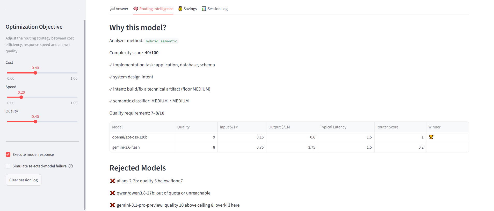
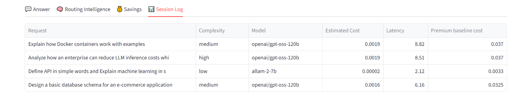

# ModelMesh

Intelligent LLM routing infrastructure that selects the most suitable AI model for each request based on complexity, cost, latency, quality requirements, and provider availability.

> Built for the **AI Infra Summit Hackathon** (lablab.ai × Kisaco Research), September 2026.

**Live Demo:** https://modelmesh.streamlit.app/

**Repository:** https://github.com/hussnain-sulehri/ModelMesh

---

## Results at a Glance

Measured on a 20-prompt benchmark (7 low, 7 medium, 6 high) with real API calls:

| Metric | Result |
|---|---|
| Complexity classified correctly | **20 / 20** (up from 15 / 20) |
| Paraphrased prompts classified correctly | **40 / 41** (up from 27 / 40) |
| Confidently wrong routing decisions | **0** (down from 6) |
| Estimated cost vs. always using Gemini 3.1 Pro | **$0.0235 vs $0.4899 — 95.2% lower** |
| Average latency for simple requests | **0.4 s** |
| Failed requests | **0** |



---

## The Problem

Most AI applications send every request to the same powerful model.

A request like *"Explain what HTML is"* does not need the same model as *"Design a distributed AI inference platform with dynamic routing, fallback handling, and optimization."*

Using one model for everything creates:
- Unnecessary API cost
- Increased latency
- Wasted capacity on premium models
- Poor use of different models' strengths — some are fast and cheap, some reason better

**The real challenge:** how do we automatically pick the right model for every request, reliably, even when the same request is worded differently?

## What ModelMesh Does

ModelMesh sits between an application and multiple AI providers, replacing "always use the biggest model" with an explainable decision layer:

```
User Request → Complexity Intelligence → Routing Engine (Cost + Speed + Quality) → Best Available Model → Response
```

For every request, it:
- Classifies complexity as LOW, MEDIUM, or HIGH
- Filters models by the quality the task needs
- Scores the remaining models on cost, speed, and quality
- Executes the winner, falling back automatically if it fails
- Explains why it chose that model and rejected the others
- Measures latency, tokens, cost, and savings against the premium model

---

## Key Features

### 1. Hybrid Complexity Intelligence

Keyword-only routing was unstable: rewording a prompt could move it between complexity levels. The analyzer now combines topic signals, request intent, and a confidence gate:

```
                 User Request
                      |
                      v
   Keyword + technical domain detection
   (whole-word matching, no double counting)
                      |
                      v
   Intent detection
   (define / explain how / build / design at system level)
   (scope: "small app" vs "millions of users")
                      |
                      v
        Complexity score + allowed range
                      |
          +-----------+-----------+
          |                       |
   Far from a boundary      Near a boundary or
   → decide instantly       conflicting signals
     (no extra call)        → semantic LLM classifier,
                              kept within the allowed range
          |                       |
          +-----------+-----------+
                      v
             LOW / MEDIUM / HIGH
```

**Why intent matters:** topic words say what a prompt is *about*; intent says how much work the *answer* takes. "Explain how to deploy Flask on cloud infrastructure" and "Design cloud infrastructure" share topic words but need very different models. Rewording usually changes topic words, rarely intent.

**Benefits:**
- Clear requests skip the classifier call (fast and free)
- Ambiguous requests get a semantic second opinion
- A wrong classifier answer cannot push a request outside what its intent allows — for example, "explain how Docker works with examples" can never drop to LOW
- Every decision stays explainable in the UI

### 2. Complexity Levels

| Level | Example Prompts | Routed To (default weights) |
|---|---|---|
| **LOW** | "Explain HTML", "What is Python?", "Define API" | Allam 2 7B |
| **MEDIUM** | "Write a JWT authentication API", "Explain how Docker containers work with examples" | GPT-OSS 120B |
| **HIGH** | "Design scalable AI SaaS architecture", "Compare RAG, fine-tuning and agents for an enterprise" | GPT-OSS 120B, or Gemini 3.1 Pro when quality is prioritised |

### 3. Intelligent Routing Engine

Models are scored on quality, estimated cost, and latency using adjustable weights, after two filters:
- **Quality floor** — blocks complex requests from reaching weak models
- **Quality ceiling** — blocks simple requests from reaching expensive models. A model above the ceiling is still allowed if it is *cheaper* than every model inside the band, because a better, cheaper model is not overkill.

The router explains:
- Why a model was selected
- Why each other model was rejected
- The score every candidate received
- Estimated savings against the premium model

Moving the **Quality** slider to maximum switches HIGH requests to Gemini 3.1 Pro, showing the weights directly change routing.

### 4. Reliability & Fallback

A production router can't fail just because one provider does.

```
Selected Model → Failure → Next Suitable Model (never below the quality floor) → Response
```

- Quota and rate-limit failures mark a model unavailable for the session
- Fallback prefers models closest in quality to the original choice
- Tested with invalid keys, unavailable models, provider errors, exhausted quotas, and a built-in "simulate failure" switch


---

## Model Catalogue

| Tier | Model | Provider | Quality | Input $/1M | Output $/1M |
|---|---|---|---|---|---|
| Fast | Allam 2 7B | Groq | 5 | 0.04* | 0.08* |
| Balanced | Qwen 3.8 27B | Groq | 7 | 0.80 | 4.00 |
| Reasoning | GPT-OSS 120B | Groq | 9 | 0.15 | 0.60 |
| Advanced | Gemini 3.6 Flash | Google | 8 | 0.75 | 3.75 |
| Premium | Gemini 3.1 Pro Preview | Google | 10 | 2.00 | 12.00 |

\* Provider price listed as pending; used as a routing estimate. Every price in `models.py` records its source URL and verification date.

## Multi-Provider Architecture

- **Groq** — fast inference, low-cost execution
- **Google Gemini** — premium reasoning and long context

A provider abstraction layer allows adding **OpenAI, Anthropic, Mistral, and local models** without changing routing logic.

---

## Benchmark Results

`benchmark/run_benchmark.py` runs all 20 prompts in `benchmark/prompts.json` through the full analyzer, router, and providers.

| | Before | After |
|---|---|---|
| Correct complexity | 15 / 20 | 20 / 20 |
| Total estimated cost | $0.0622 | $0.0235 |
| Savings vs. always Gemini 3.1 Pro | 85.9% | 95.2% |
| Avg latency — LOW | 7.9 s | 0.4 s |
| Avg latency — MEDIUM | 10.7 s | 12.4 s |
| Avg latency — HIGH | 21.2 s | 25.7 s |

Example requests from the run:

| Request | Model | Est. cost | Gemini Pro cost | Saved |
|---|---|---|---|---|
| Explain what HTML is | Allam 2 7B | $0.000023 | $0.003468 | 99.3% |
| Design a scalable AI SaaS platform architecture supporting millions of users | GPT-OSS 120B | $0.001856 | $0.036998 | 95.0% |

### Stability Under Rewording

`benchmark/check_analyzer_stability.py` runs the analyzer on 41 paraphrases across 13 request groups (for example *"Write Python code for JWT authentication API"* vs *"I need a Flask endpoint that issues and verifies JWT tokens"*) and checks every variant lands at the same level. It needs no API keys.

| | Before | After |
|---|---|---|
| Paraphrases classified correctly | 27 / 40 | 40 / 41 |
| Request groups that split across levels | 8 of 13 | 1 of 13 |
| Correct when the classifier always answers LOW | 32 / 49 | 48 / 49 |

The one remaining miss is sent to the semantic classifier rather than being routed with false confidence.



---

## Development Journey

| Version | Improvement | Result |
|---|---|---|
| v1 | Basic Streamlit router prototype | Initial routing concept |
| v2 | Cost, latency, quality scoring | Routing became explainable |
| v3 | LOW / MEDIUM / HIGH complexity levels | Models matched task difficulty |
| v4 | Provider execution layer | Requests reached real models |
| v5 | Fallback handling | System survived provider failures |
| v6 | Cost tracking and savings calculation | Optimization became measurable |
| v7 | Improved session management | Removed duplicate executions and stale responses |
| v8 | Hybrid complexity analyzer | Better handling of unseen complex requests |
| v9 | Demo interface improvements | Quick demos, routing explanation, savings chart |
| v10 | Intent-aware analyzer, confidence gate, cost-aware ceiling | 20/20 benchmark, stable under rewording, 95% savings |

## Challenges Faced

**Unstable classification under rewording** — substring matching ("ai" inside "explain") and double-counted keywords let one word swing a prompt between levels.
→ *Solved with whole-word matching, intent detection, and a confidence gate based on distance from the level boundaries.*

**Classifier overriding good decisions** — the semantic classifier sometimes labelled "explain how Docker works with examples" as LOW.
→ *Solved by limiting the classifier to the range the request's intent allows.*

**Ceiling rejecting a better, cheaper model** — medium requests went to a pricier model because a higher-quality, cheaper one was above the ceiling.
→ *Solved by only rejecting above-ceiling models that don't save money.*

**Free-tier quotas** — Gemini's daily limits could be exhausted by a live demo.
→ *Solved by cost-aware routing that keeps default traffic on Groq, plus automatic fallback.*

**Model availability changes** — provider model IDs became unavailable mid-development.
→ *Solved with a provider abstraction layer and `verify_models.py` preflight checks.*

**Streamlit session state bugs** — changing the prompt sometimes left the old response visible.
→ *Solved with prompt-change detection and result clearing.*

---

## Demo Scenarios

| Request Type | Example | Expected Routing |
|---|---|---|
| Simple | Explain what HTML is | LOW → Allam 2 7B |
| Medium | Write Python code for JWT authentication API | MEDIUM → GPT-OSS 120B |
| Complex | Design scalable architecture for AI SaaS platform | HIGH → GPT-OSS 120B |
| Complex, quality prioritised | Same prompt with the Quality slider at maximum | HIGH → Gemini 3.1 Pro (or automatic fallback) |

The dashboard shows the selected model, latency, token usage, estimated savings, routing explanation, rejected alternatives, and a cumulative cost chart.

## Architecture

```
app.py                                → Streamlit UI and demo workflow
analyzer.py                           → Complexity intelligence and confidence gating
router.py                             → Model selection engine
models.py                             → Model catalogue and cost calculation
providers.py                          → Gemini / Groq calls and fallback handling
config.py                             → Secrets management
verify_models.py                      → Provider availability and catalogue checks
benchmark/prompts.json                → 20 labelled benchmark prompts
benchmark/run_benchmark.py            → End-to-end benchmark with real API calls
benchmark/check_analyzer_stability.py → Offline paraphrase stability test
benchmark/test_analyzer_variants.py   → Paraphrase test cases
```

## Getting Started

```bash
git clone https://github.com/hussnain-sulehri/ModelMesh
cd ModelMesh

python -m venv venv
source venv/bin/activate      # Windows: venv\Scripts\activate

pip install -r requirements.txt
```

Create a `.env` file:
```
GEMINI_API_KEY=your_key
GROQ_API_KEY=your_key
```

Run the app:
```bash
streamlit run app.py
```

Test and benchmark:
```bash
python benchmark/check_analyzer_stability.py   # offline, no API calls
python verify_models.py --offline              # catalogue checks, no API calls
python benchmark/run_benchmark.py              # 20 real API calls
```

---

## Current Limitations

- Model quality scores are manually assigned, not measured by benchmarks
- Costs are estimated from provider list prices; free-tier usage may cost nothing
- The benchmark is small (20 prompts, 41 paraphrases) and labelled by the author
- Routing does not yet learn from feedback
- Only Groq and Gemini are integrated
- No semantic caching for repeated requests

## Roadmap

1. **Benchmark-driven routing** — replace manual quality scores with measured accuracy and latency
2. **Learning router** — tune decisions from feedback and historical success rates
3. **Enterprise AI gateway** — team dashboards, budget controls, API gateway deployment
4. **More providers** — OpenAI, Anthropic, Mistral, and local inference models

## Built With

Python · Streamlit · Google Gemini API · Groq API · Plotly

---

*ModelMesh doesn't ask "Which is the strongest AI model?" — it asks "Which model is the right choice for this request?"*
